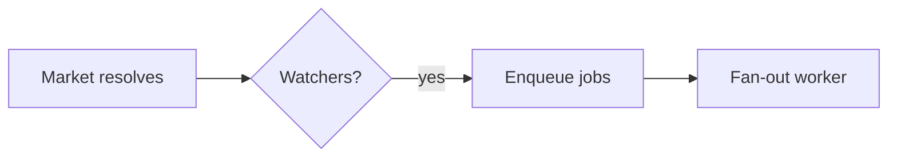

# Plan Canvas

Review loop for plans and visual artifacts: you write the artifact, the human
reviews it in the browser — annotating the exact element they mean, chatting,
and delivering an **Approve plan / Request changes** verdict — while you block
on a single CLI call that returns their feedback as JSON.

Inspired by [lavish-axi](https://github.com/kunchenguid/lavish-axi); rebuilt
ECC-native around the `/plan` confirmation gate, with zero dependencies.

## When to Use

- You just wrote a plan artifact (`.claude/plans/*.plan.md` from `/plan`) and
  need the CONFIRM/approve decision — the canvas verdict replaces a typed
  "yes/proceed".
- The user should *point at* what to change: reviewing designs, comparisons,
  reports, or any local `.md` / `.html` artifact.
- The user asks for `/plan-canvas`, a visual review, or "open it in the browser".

Do NOT use for: code review of diffs (`/code-review`), running web apps, or
remote URLs. The canvas serves local artifact files only.

## How It Works

Invoke the CLI as `ecc-plan-canvas` — the bin shipped by the `ecc-universal`
package (on PATH after a global/plugin install; `node "$CLAUDE_PLUGIN_ROOT/scripts/plan-canvas.js"`
also works for plugin installs). Run it from the project you are reviewing in;
it works from any working directory. It manages a detached loopback server
(`127.0.0.1:4517`) shared by all sessions, keyed by artifact path — no session
ids to track.

The workflow is a plain CLI-plus-JSON loop, so it is model- and harness-agnostic:
any agent that can run a shell command and read stdout drives it the same way
(Claude Code, Codex, Cursor, Gemini, OpenCode, Copilot). Trigger it however your
harness surfaces skills — e.g. `/plan-canvas` in Claude Code, `$plan-canvas` in
Codex — or just run the `ecc-plan-canvas` commands directly.

```bash
# 1. Open the artifact in the user's browser (returns immediately)
ecc-plan-canvas open .claude/plans/feature.plan.md

# 2. Block until the human responds. Leave running; re-run if interrupted —
#    queued feedback is never lost. Run in the background if your harness
#    time-limits foreground commands.
ecc-plan-canvas await .claude/plans/feature.plan.md
```

`await` prints JSON when the human acts:

```json
{
  "status": "feedback",
  "items": [
    { "kind": "annotation", "text": "Split this into two phases",
      "anchor": { "selector": "h2:nth-of-type(3)", "tag": "h2", "snippet": "Phase 2: Migration" } },
    { "kind": "verdict", "verdict": "request-changes" }
  ]
}
```

- `kind: "chat"` — freeform message; answer in the canvas, not the terminal.
- `kind: "annotation"` — feedback anchored to an element (`anchor.selector`,
  `anchor.snippet` show what they pointed at; `anchor.textRange.text` when
  they highlighted a passage).
- `kind: "verdict"` — `approve` means the plan is CONFIRMED: stop polling,
  end the session, and start implementing. `request-changes` means revise the
  artifact (the canvas live-reloads it) and keep the loop going.

**3. Respond in the canvas**, then keep listening — one command does both:

```bash
ecc-plan-canvas await <file> --reply "Split Phase 2 as requested — take a look."
```

**4. End** when review concludes: `ecc-plan-canvas end <file>`.

## Diagrams (Mermaid)

When part of the plan is a flow, architecture, sequence, state machine, ER
model, or dependency graph, author it as a fenced ` ```mermaid ` block instead
of ASCII art or a wall of prose — the canvas renders it as a themed diagram the
human can point at. Reach for it when a picture reads faster than a paragraph;
skip it for simple lists or tables.

````markdown

````

Diagrams render in the ECC dark theme with the accent palette. Mermaid loads in
the browser from a pinned CDN; if that is unavailable (offline), the block
degrades to showing its source, so the review is never blocked. Point a local
mirror at `ECC_PLAN_CANVAS_MERMAID_URL` for air-gapped use.

## Rules

- Markdown artifacts render in ECC's plan template (including Mermaid blocks);
  `.html` artifacts render as-is with the annotation layer injected. For HTML
  authoring guidance use the `frontend-design-direction` and `artifact-design`
  skills.
- Edit the artifact file to revise — the canvas live-reloads on save. Never
  re-run `open` to refresh.
- `{"status": "ended", "endedBy": "user"}` (or `sessionEnded: true` on a
  feedback batch) means the user closed the review: stop polling, deliver
  remaining updates in chat, and do not reopen. A plain `open` on that
  session is refused; pass `--reopen` only when the user asks to resume.
- Sibling assets (images, CSS) must sit next to the artifact and be
  referenced by relative path.
- The server is loopback-only and exits after 30 idle minutes
  (`ECC_PLAN_CANVAS_IDLE_MS`); `stop` shuts it down explicitly. State lives
  in `~/.claude/plan-canvas/` (`ECC_PLAN_CANVAS_STATE_DIR`).

## Examples

**Plan approval flow** — `/plan` writes
`.claude/plans/notifications.plan.md` and must WAIT for confirmation:

```bash
ecc-plan-canvas open .claude/plans/notifications.plan.md
ecc-plan-canvas await .claude/plans/notifications.plan.md
# → {"status":"feedback","items":[{"kind":"verdict","verdict":"approve"}]}
ecc-plan-canvas end .claude/plans/notifications.plan.md
# plan is confirmed — begin implementation
```

**Revision loop** — feedback arrives, you edit the file, reply, keep listening:

```bash
# await returned annotations → edit the .plan.md (canvas live-reloads)
ecc-plan-canvas await <file> --reply "Reworked the risk table."
# → blocks again until the next response
```

## Anti-Patterns

- Polling with `--timeout-ms` in a loop — it exists for tests. Leave the
  plain `await` running instead.
- Reopening after a user-initiated end "just to show" something.
- Pasting the whole plan into chat *and* opening a canvas — pick the canvas
  and keep the terminal summary to one line.
- Parsing the canvas chat from state files — everything you need arrives via
  `await`.
