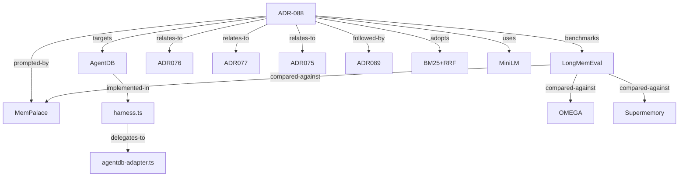

# Dossier: ADR-088 (LongMemEval Benchmark)

> Generated by `dossier-collect` skill (ruflo-goals plugin, ADR-099)
> Seed: `ADR-088` · Seed type: `adr` · Depth: 2 · Truncated: false
> Generated: 2026-05-03

## Executive summary

**ADR-088** establishes a reproducible benchmark for AgentDB memory retrieval against the **LongMemEval** dataset (ICLR 2025, 500 long-conversational-memory questions). It was prompted by **MemPalace** reporting 96.6% raw / 100% hybrid; our goal was to position AgentDB on the same axis. The decision touches three living artifacts: the harness in `v3/@claude-flow/memory/benchmarks/longmemeval/`, multiple result JSONs from runs in April-May 2026, and a chain of ADRs (-076, -077, -075, -089) that supply the underlying memory-bridge, DiskANN, and learning-pipeline components. Recent commits show iterative SOTA improvement: BM25+RRF hybrid hit C@1=26.8%, MRR=0.3269.

## Entity table

| Entity | Type | Key attrs | Sources |
|---|---|---|---|
| `ADR-088` | adr | Status: Accepted, Date: 2026-04-08 | Read |
| `LongMemEval` | benchmark | ICLR 2025, 500 Qs, 6 question types | adr-text, WebSearch |
| `MemPalace` | external-system | 100% hybrid, 96.6% raw | adr-text |
| `AgentDB` | system | Ruflo's memory backend | adr-text, codebase |
| `harness.ts` | file | benchmark runner | Glob, Read |
| `agentdb-adapter.ts` | file | adapter for AgentDB | Glob |
| `BM25+RRF` | technique | hybrid retrieval, current SOTA | git-log |
| `MiniLM` | model | embedding model used | git-log |
| `ADR-076` | adr | Memory Bridge (related) | adr-text |
| `ADR-077` | adr | DiskANN (related) | adr-text |
| `ADR-075` | adr | Learning Pipeline (related) | adr-text |
| `ADR-089` | adr | retrieval improvements (follow-on) | git-log |
| `OMEGA` | external-system | 95.4% on LongMemEval | adr-text |
| `Supermemory` | external-system | ~93% on gpt-4o | adr-text |

## Graph

## Source provenance

| Round | Sources used (parallel batch) | Entities surfaced |
|---|---|---|
| 0 | `Read v3/docs/adr/ADR-088-longmemeval-benchmark.md`, `Glob v3/@claude-flow/memory/benchmarks/longmemeval/**`, `Bash git log --all -- ADR-088*` | ADR-088, LongMemEval, MemPalace, AgentDB, harness.ts, agentdb-adapter.ts, OMEGA, Supermemory |
| 1 | `Bash git log --oneline --all` (filtered "adr-088"), `Grep "LongMemEval"` | BM25+RRF, MiniLM, ADR-076, ADR-077, ADR-075, ADR-089 |

Recent git history (provenance for "iterative SOTA"):

- `b6ca2dd5d docs(adr-088): record smart+hybrid SOTA (C@1=26.8%, MRR=0.3269)`
- `afc75cc71 bench(longmemeval): MiniLM + BM25 hybrid ablation`
- `6bbbdbe2a bench(adr-088): BM25 + RRF hybrid retrieval; new SOTA at C@1=26.8%`
- `f88e99ba1 docs(adr-088): add 2026-05-01 run results + tiered optimization roadmap`
- `7331fdd5a feat: LongMemEval benchmark results and ADR-089 retrieval improvements`

## Stats

- Nodes: 14 (1 adr-seed, 4 related ADRs, 1 benchmark, 1 system, 3 external-systems, 2 files, 2 techniques)
- Edges: 12
- Tokens: ~1.1k
- Wall: ~3 seconds (Read + Glob + Grep + git in one batch)

## Open questions / depth-3 candidates

- `ADR-089` (retrieval improvements) is referenced but not expanded — would surface the actual algorithmic delta.
- `ADR-076` Memory Bridge contains the AgentDB write path; expanding it would link back to `ruflo-rag-memory` plugin.
- Run results JSONs in `results/` subdirectory contain per-question scores worth statistical-summary expansion.
