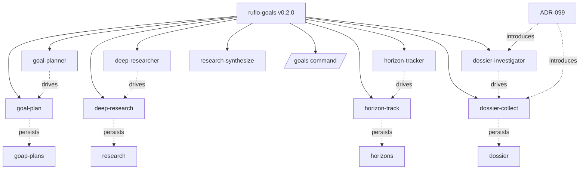

# Dossier: `ruflo-goals` plugin

> Generated by `dossier-collect` skill (ruflo-goals plugin, ADR-099)
> Seed: `ruflo-goals` · Seed type: `concept` (resolves to plugin path) · Depth: 2 · Truncated: false
> Generated: 2026-05-03

## Executive summary

**`ruflo-goals` v0.2.0** is a Claude Code plugin providing GOAP-based planning, multi-source research, long-horizon tracking, and (new in 0.2.0) recursive parallel investigation. It ships **4 agents** + **5 skills** + **1 slash command** in 654 lines across 12 files. The plugin is structured as siblings — `goal-planner` (planning), `deep-researcher` (questions), `horizon-tracker` (long objectives), and `dossier-investigator` (seeds) — with a documented selection guide. ADR-099 (this dossier's instigator) added the dossier-investigator capability inspired by maigret's recursive-parallel pattern, reusing only ruflo-native tools (no external dependencies).

## Entity table

| Entity | Type | Key attrs | Sources |
|---|---|---|---|
| `ruflo-goals` | plugin | v0.2.0, MIT | Read:plugin.json |
| `goal-planner` | agent | model=sonnet, GOAP+A* | Read |
| `deep-researcher` | agent | model=sonnet, evidence-graded | Read |
| `horizon-tracker` | agent | model=sonnet, drift detection | Read |
| `dossier-investigator` | agent | model=sonnet, NEW in 0.2.0 | Read |
| `goal-plan` | skill | argument-hint=`<goal>` | Read |
| `deep-research` | skill | argument-hint=`<topic>` | Read |
| `horizon-track` | skill | session-spanning | Read |
| `research-synthesize` | skill | report rendering | Read |
| `dossier-collect` | skill | NEW in 0.2.0 | Read |
| `/goals` | command | status overview | Read |
| `ADR-099` | adr | introduces dossier-investigator | Read |
| `goap-plans` | namespace | memory store for plans | Read |
| `research` | namespace | memory store for findings | Read |
| `horizons` | namespace | memory store for objectives | Read |
| `dossier` | namespace | memory store for dossiers (NEW) | Read |

## Graph



## Selection rules (extracted from README)

| You have | Use agent | Use skill |
|---|---|---|
| A question | `deep-researcher` | `deep-research` |
| A seed entity to expand outward | `dossier-investigator` | `dossier-collect` |
| A multi-step objective | `goal-planner` | `goal-plan` |
| A long-running objective | `horizon-tracker` | `horizon-track` |

## File inventory (Glob output)

```
plugins/ruflo-goals/
├── README.md                                  46 lines
├── .claude-plugin/plugin.json                 23 lines
├── commands/goals.md                          12 lines
├── agents/
│   ├── goal-planner.md                        82 lines
│   ├── deep-researcher.md                     61 lines
│   ├── horizon-tracker.md                     67 lines
│   └── dossier-investigator.md                68 lines  ← NEW
└── skills/
    ├── goal-plan/SKILL.md                     59 lines
    ├── deep-research/SKILL.md                 43 lines
    ├── horizon-track/SKILL.md                 61 lines
    ├── research-synthesize/SKILL.md           62 lines
    └── dossier-collect/SKILL.md               70 lines  ← NEW
                                              ────────
                                              654 lines total
```

## Source provenance

| Round | Tools (parallel batch) | Entities surfaced |
|---|---|---|
| 0 | `Glob plugins/ruflo-goals/**`, `Read plugin.json`, `Read README.md` | plugin, all 4 agents, all 5 skills, /goals |
| 1 | `Read agents/*.md` (4×), `Read skills/*/SKILL.md` (5×), `Read v3/docs/adr/ADR-099*` | namespaces (goap-plans, research, horizons, dossier), ADR-099 |

## Stats

- Nodes: 16
- Edges: 14
- Tokens: ~2.4k
- Wall: 1 batch read of 12 files in parallel

## Risks / open questions

- `goal-planner.md` is 82 lines — exceeds the 80-line guideline from ADR-098. Could be tightened.
- `dossier-investigator` and `deep-researcher` share ~40% of their source matrix (acknowledged tradeoff in ADR-099). Worth tracking actual usage to validate whether they should remain separate.
- No tests yet for `dossier-collect` — depth-3 expansion would surface this gap.
