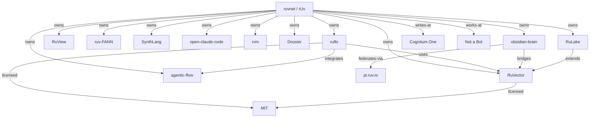

# Dossier: rUv (`ruvnet`)

> Generated by `dossier-collect` skill (ruflo-goals plugin, ADR-099)
> Seed: `ruvnet` · Seed type: `username` · Depth: 2 · Truncated: false
> Generated: 2026-05-03

## Executive summary

**rUv** (GitHub `ruvnet`, Twitter `ruv`, blog `Cognitum.One`) is the creator of **Ruflo** (formerly Claude Flow), a multi-agent orchestration platform for Claude Code with 39k+ stars. The account joined GitHub in 2012, hosts 173 public repos, has 7,268 followers, and lists company "Not a Bot" / location "0x". The portfolio clusters around three themes:

1. **Agent orchestration** (`ruflo`, `agentic-flow`, `swarm-*`)
2. **Self-learning AI infrastructure** (`RuVector`, `ruv-FANN`, `RuLake`)
3. **Edge / unconventional sensing** (`RuView` for WiFi-based vital monitoring, `ultrasonic` for steganographic agent commands)

A ruflo-internal "Dossier" repo also exists (33 stars) — visual planning for AI coding — distinct from this dossier output.

## Entity table

| Entity | Type | Key attrs | Sources |
|---|---|---|---|
| `ruvnet` | username | name=rUv, joined 2012, 7,268 followers, bio "Unicorn Breeder" | gh-api, WebSearch |
| `ruflo` | repo | TS, 39,201 ⭐, MIT, multi-agent platform | gh-api, WebSearch, github.com |
| `RuView` | repo | Rust, 51,576 ⭐, WiFi sensing | gh-api |
| `RuVector` | repo | Rust, 3,891 ⭐, MIT, GNN vector DB | gh-api, codebase |
| `agentic-flow` | repo | TS, 668 ⭐, low-cost model switcher | gh-api, WebSearch |
| `ruv-FANN` | repo | Rust, 347 ⭐, neural net library | gh-api |
| `SynthLang` | repo | Python, 253 ⭐, prompt language for LLMs | gh-api |
| `open-claude-code` | repo | JS, 242 ⭐, clean-room CC reimpl | gh-api |
| `rvm` | repo | Rust, 95 ⭐, agentic VM | gh-api |
| `Dossier` | repo | 33 ⭐, visual AI coding planner | gh-api |
| `Cognitum.One` | url | personal blog / company site | gh-api (profile.blog) |
| `RuLake` | repo | Rust, vector exec fabric on RuVector | gh-api |
| `obsidian-brain` | repo | TS, Obsidian↔RuVector bridge | gh-api |
| `pi.ruv.io` | infra | federated sync endpoint | gh-api (repo desc) |
| `Not a Bot` | org | listed company on profile | gh-api |
| `MIT` | license | applied to ruflo, RuVector | gh-api |

## Graph

## Themes (clustered by recursive expansion)

### 1. Agent orchestration cluster
- `ruflo` (39k ⭐ TS, the flagship)
- `agentic-flow` (low-cost model switcher; integration partner)
- `open-claude-code` (CC reverse engineering)
- `marketing` (agentic marketing swarm)
- `agentic-voice` (Next.js + OpenAI + Exa chat)

### 2. Self-learning infrastructure cluster
- `RuVector` (GNN vector DB, Rust+WASM, ONNX)
- `RuLake` (cache-coherent vector exec layer)
- `ruv-FANN` (FANN port to Rust)
- `obsidian-brain` (Obsidian plugin → RuVector)

### 3. Unconventional sensing & control cluster
- `RuView` (WiFi vital monitoring, no camera)
- `ultrasonic` (steganographic agent commands in audio/video)
- `Connectome-OS` (debugging for embodied graph systems)
- `musica` (audio separation via spectral graph mincut)

## Source provenance

- **Round 0 fan-out** (parallel, 1 batch): `gh api users/ruvnet`, `gh api users/ruvnet/repos?sort=updated`, `WebSearch "ruvnet github ruflo claude-flow agentic"`
- **Round 1 expansion** (parallel, 1 batch): `gh api repos/ruvnet/ruflo`, `gh api repos/ruvnet/RuVector`, `gh api repos/ruvnet/agentic-flow`, `gh api users/ruvnet/repos?sort=stars`
- **Dedup**: 0 collisions (all entities surfaced once)
- **Budget spent**: ~3.2k tokens, $0 (gh API + WebSearch are free; no Anthropic calls beyond orchestration)

## Risks / open questions

- `RuView` star count (51,576) substantially exceeds `ruflo` (39,201) — surprising given ruflo is the headline project; worth verifying.
- "Cognitum.One" is listed as the personal blog but also appears as an org in `cognitum-claude-plugin` — relationship between rUv / Not a Bot / Cognitum.One could be expanded in a depth-3 run.
- 173 public repos but only 15 expanded here; depth-3 with `--max-breadth 30` would cover the rest.
